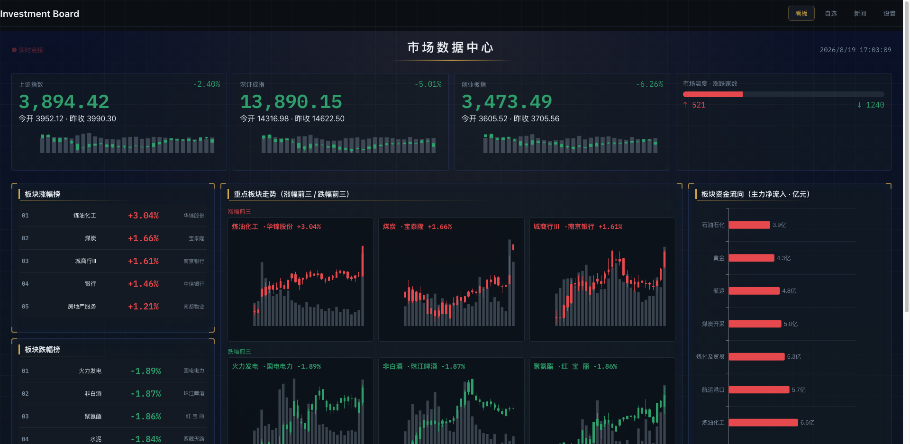
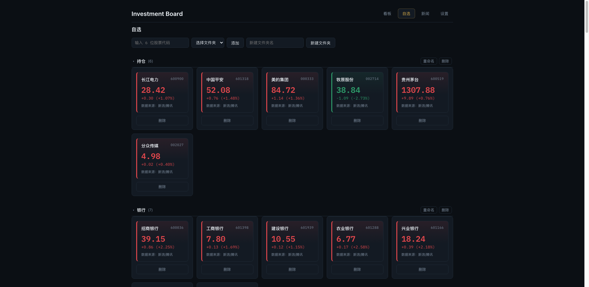

# Investment Board（股票看板）

个人自托管、**只读**的股票看板：本地自选列表（增删）+ 实时行情 + 个股与全局新闻。全部数据来自公开接口，无需任何账户登录。仅供个人学习研究，不构成投资建议。

## 功能预览





## 功能特性

- **看板大屏**：多维数据大屏，共 7 个模块——大盘指数、市场温度、板块涨跌排行、资金流向、重点板块 K 线、自选、新闻，每 30s 自动刷新；数据源为东方财富公开接口 + 新浪 / 腾讯行情
- **DataV 视觉**：深色渐变背景（顶部光晕 + 网格纹理）、模块发光边框 + 四角角标、顶部大标题区（实时时钟 + 连接状态）、超大等宽数字（IBM Plex Mono）、数字跳动（count-up）与底部自选行情轮播动效，动效尊重系统「减弱动态效果」设置
- **自选**：本地自选列表管理页，支持文件夹分类（同花顺式：新建 / 重命名 / 删除 / 折叠展开），顶部统一输入 6 位代码按文件夹添加；预置「持仓 + 15 领域龙头」16 个文件夹、111 只股票，行情卡随自选实时联动
- **新闻**：全局快讯流 + 个股新闻（按自选列表自动筛选），支持已读标记
- **设置**：数据源健康状态（行情 / 新闻）

## 快速开始

前置要求：macOS / Linux，Python ≥ 3.11，Node ≥ 20。

1. 安装依赖：
   ```bash
   make install
   ```
2. 启动后端（终端 1）：
   ```bash
   make dev-backend
   ```
3. 启动前端（终端 2）：
   ```bash
   make dev-frontend
   ```

浏览器打开 <http://localhost:5173>（Vite 默认绑定 localhost，可能为 IPv6 `::1`，个别环境可用 <http://127.0.0.1:5173>）。在「自选」页输入 6 位股票代码（如 600519）即可添加并查看实时行情，无需任何登录。

后端健康检查：

```bash
curl -s http://127.0.0.1:8210/api/status
# {"sources":{"market":"ok","news":"ok"}}
```

## 部署

### 本地生产运行（后端托管前端）

1. 构建前端产物：
   ```bash
   cd frontend && npm ci && npm run build
   ```
2. 启动后端（自动托管 `frontend/dist`，单端口同源）：
   ```bash
   cd backend && .venv/bin/uvicorn app.main:app --host 127.0.0.1 --port 8210
   ```
3. 浏览器打开 <http://127.0.0.1:8210>。

### Docker 部署

一键构建并启动：

```bash
docker compose up -d
```

浏览器打开 <http://127.0.0.1:8210>。停止服务：

```bash
docker compose down
```

- 单容器部署：前端构建产物与后端同进程，单端口 `127.0.0.1:8210`
- 数据持久化：自选数据存入 Docker volume `investment-data`，`docker compose down` 不会丢失
- 隐私保持：端口仅映射到本机 `127.0.0.1`，容器不对外暴露

## 技术架构

| 层 | 技术 |
| --- | --- |
| 后端 | FastAPI + uvicorn（Python 3.11） |
| 前端 | React + Vite + ECharts（TypeScript） |
| 数据源 | 新浪 / 腾讯公开行情接口、东方财富公告、财联社电报 |
| 实时推送 | 后端事件总线 + WebSocket（前端自动重连） |

总览与模块职责见 [docs/architecture.md](docs/architecture.md)（含 Mermaid 架构图与数据流）。

## 目录结构

```
investment-board/
├── backend/
│   ├── app/
│   │   ├── main.py            # FastAPI 入口（lifespan 组装采集器与调度器）
│   │   ├── api/               # REST（/api/*）+ WebSocket（/ws）
│   │   ├── core/              # 调度器（3s/60s 采集循环）+ 事件总线 + 本地自选存储
│   │   ├── market/            # 行情源适配器（新浪为主、腾讯为备）
│   │   ├── news/              # 新闻源适配器（东财公告 + 财联社电报）
│   │   └── models.py          # 数据模型
│   ├── tests/                 # pytest 测试（respx 模拟 HTTP，不依赖真实账号）
│   └── pyproject.toml
├── frontend/                  # React + Vite + ECharts（深色主题）
│   └── src/
│       ├── pages/             # 看板 / 自选 / 新闻 / 设置
│       ├── api/               # REST 客户端 + WebSocket（自动重连）
│       └── store.tsx          # zustand 状态
├── docs/                      # 架构 / 合规说明
├── scripts/check_no_trade.py  # 合规静态检查（禁止交易语义）
├── Dockerfile                 # 多阶段构建（node 构建前端 → python 运行后端）
├── docker-compose.yml         # 一键部署（单端口 127.0.0.1:8210）
├── Makefile                   # install / dev / check / lint / test / build
├── LICENSE
└── README.md
```

## 数据源与合规

- **纯公开数据源**：仅使用新浪、腾讯、东方财富、财联社等公开接口，不接入任何需登录的第三方账户接口（无同花顺 / 券商账户查询）
- **只读、无交易功能**：后端代码级限制——无任何下单 / 撤单 / 委托能力；CI 静态检查（`scripts/check_no_trade.py`）会拦截任何含交易语义的标识符，从代码层面保证只读
- **数据版权**：数据版权归新浪 / 腾讯 / 东方财富 / 财联社等各数据源所有；本项目不存储、再分发其数据
- **访问频率受控**：行情 3s、新闻 60s（+ 随机抖动），不进行高频抓取
- **仅供个人学习研究**，不构成任何投资建议

完整合规说明见 [docs/compliance.md](docs/compliance.md)。

## 隐私

- **数据不出本机**：后端只绑定 `127.0.0.1`（端口 8210），Docker 端口仅映射到 localhost，无遥测、无上报、无第三方 SDK
- **本地自选列表**：仅存于本机 `~/.investment-board/watchlist.json`（JSON 明文，含并发锁与原子写），可在「设置」页或直接删除该文件清除
- **无需登录**：不存在任何账户凭据、会话令牌或加密密钥

## 开发与验证

```bash
make check     # 合规静态检查（禁止交易语义标识符 / 中文词）
make lint      # ruff + yapf + eslint + prettier
make typecheck # mypy + tsc
make test      # 后端 pytest（31 个用例）
make build     # 前端 TypeScript 检查 + Vite 构建
```

CI（GitHub Actions）会自动执行以上检查。

## 常见问题（FAQ）

### 1. 新闻页没有数据？

全局快讯与个股公告依赖第三方公开接口（财联社电报 / 东财公告），可能因第三方接口变化或风控而暂时无数据，后端会记录告警日志并优雅返回空列表（不会崩溃）。这是外部数据源的预期行为，可稍后再试。

### 2. 行情不更新 / 显示异常？

行情来自新浪 / 腾讯的公开接口，同样可能因接口变化或风控而暂时无数据。后端会记录告警日志并优雅降级（不崩溃），可稍后再试；若持续异常，可查看后端日志（`cd backend && ./run.sh`）。

### 3. 如何修改端口 / 绑定地址？

后端支持环境变量 `IB_PORT`（端口，默认 8210）与 `IB_HOST`（绑定地址，默认 `127.0.0.1`；Docker 容器内为 `0.0.0.0`）。前端开发代理目标固定为 `127.0.0.1:8210`（见 `frontend/vite.config.ts`）。

### 4. 自选列表存在哪里？如何清除？

自选列表存于 `~/.investment-board/watchlist.json`（JSON 明文，v2 分组结构：`{version, groups:[{name, stocks}]}`，v1 扁平列表自动迁移到「未分组」）。清除方式：在「自选」页删除股票 / 删除整个文件夹（连带其中股票），或直接删除该文件（删除后按空列表处理，服务不崩溃）。

### 5. 如何反馈问题 / 贡献？

- 提交 Issue：说明复现步骤、后端日志（`cd backend && ./run.sh` 的告警输出）
- 提交 PR：遵守只读约束（不得引入任何交易语义代码，需通过 `make check`），解析器改动需配套 `respx` 驱动的单元测试

## 贡献 / License

- **只读红线**：任何改动不得引入交易语义（buy / sell / trade / order 等标识符或中文交易词），需通过 `make check`
- **提交规范**：采用约定式提交（commitlint + commitlint-config-ali）
- **License**：MIT，见 [LICENSE](LICENSE)
