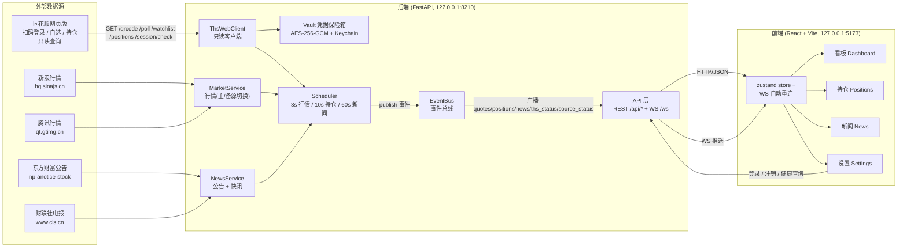

# 架构说明（Architecture）

## 总体架构图



## 数据流

### 采集循环（后端后台任务，asyncio）

```
Scheduler 启动三个循环：
  行情循环  : 每 3s+抖动  → MarketService.fetch_quotes(已知代码) → 发布 quotes 事件
  持仓循环  : 每 10s+抖动 → 已登录时 ThsWebClient.query_positions() → 合并行情 → 发布 positions 事件
  新闻循环  : 每 60s+抖动 → 已登录取个股公告 + 总是取全局快讯 → 去重 → 发布 news 事件
```

- **行情源切换**：默认新浪，失败自动切腾讯（主备互换），全部失败返回空 dict。
- **新闻去重**：按新闻 id 去重，只在 `Scheduler` 内维护 `seen_news` 集合。
- **持仓增强**：`compute_positions()` 用最新行情填充现价 / 市值 / 盈亏字段。

### 推送路径（后端 → 前端）

```
采集器 → EventBus.publish(event_type, payload)
       → 每个 /ws 连接各有一个订阅回调（每个连接只收到推给自己的一份）
       → WebSocket send_json({type, data})
       → 前端 store 按事件类型分发，断线自动重连
```

WebSocket 连接关闭时，其订阅回调会从事件总线移除，避免回调泄漏。

### 登录 / 注销流

```
设置页点击扫码
  → POST /api/login/qrcode   → 后端向 THS 请求 /qrcode → 返回二维码(base64)
  → 前端 2s 轮询 POST /api/login/poll → THS /poll
      status==1 → token 经 Vault(AES-256-GCM) 加密存 session.enc，密钥在系统 Keychain
  → 注销: POST /api/logout → Vault.clear() 删除加密会话（一键清除）
```

## 模块职责

| 模块 | 职责 |
| --- | --- |
| `backend/app/main.py` | FastAPI 入口；lifespan 中组装依赖（HTTP 客户端、Vault、采集器、调度器）并启停调度器；CORS 仅允许本机 5173 |
| `backend/app/api/routes.py` | REST：`/status`、登录 / 注销、`/quotes`、`/positions`、`/news`、`/news/{id}/read` |
| `backend/app/api/ws.py` | `/ws` WebSocket；按事件类型订阅，每连接独立推送，关闭时解绑回调 |
| `backend/app/core/scheduler.py` | 三个采集循环（行情 3s / 持仓 10s / 新闻 60s，含随机抖动），持有最新数据快照 |
| `backend/app/core/events.py` | 事件总线（subscribe / unsubscribe / publish），定义事件类型常量 |
| `backend/app/core/portfolio.py` | 持仓盈亏计算（现价 / 市值 / 浮动盈亏 / 当日盈亏） |
| `backend/app/ths_client/` | 同花顺网页版**只读**客户端：扫码登录、会话保活、自选 / 持仓查询（详见 README.md 与逆向文档） |
| `backend/app/market/` | 行情适配器：新浪（主）+ 腾讯（备），解析并归一化为 `Quote` |
| `backend/app/news/` | 新闻适配器：东财个股公告 + 财联社全局快讯，解析为 `NewsItem` |
| `backend/app/vault/` | 凭据保险箱：AES-256-GCM 加密写 `~/.investment-board/session.enc`，密钥存系统 Keychain |
| `backend/app/models.py` | 数据模型：`Stock` / `Position` / `Quote` / `IntradayPoint` / `NewsItem` |
| `frontend/src/pages/` | 四个视图：看板 / 持仓 / 新闻 / 设置 |
| `frontend/src/api/` | REST 客户端 + WebSocket（断线自动重连） |
| `frontend/src/store.tsx` | zustand 全局状态，事件分发与数据缓存 |
| `scripts/check_no_trade.py` | 合规静态检查：AST 扫描禁止交易语义标识符与中文交易词 |

## 关键决策

- **只读边界代码级强制**：THS 客户端没有任何下单 / 撤单 / 委托方法；CI 静态检查会拦截
  任何含 `buy` / `sell` / `trade` / `order` 前缀的标识符以及「委托 / 下单 / 买入」等中文词。
- **本地闭环**：后端仅监听 `127.0.0.1`，无遥测、无第三方 SDK、无外部上报。
- **分层降级**：THS 失效不影响行情 / 新闻；行情源故障自动切备源；外部接口异常一律捕获并记日志。
- **凭据安全**：令牌不明文落盘，AES-256-GCM 加密 + 系统 Keychain 保管密钥。
- **低打扰访问**：所有外部请求限频 + 随机抖动 + 超时 + 重试上限，请求头为普通浏览器 UA。
